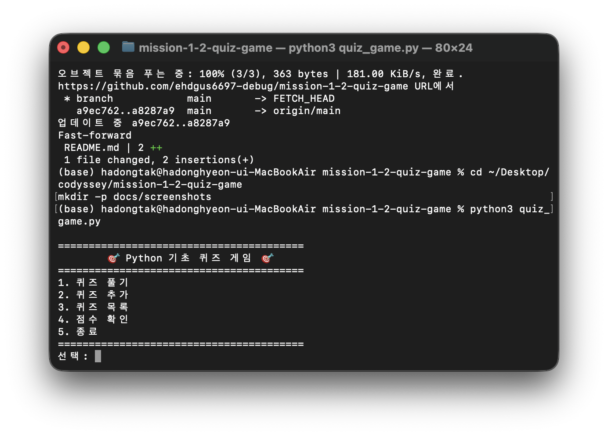
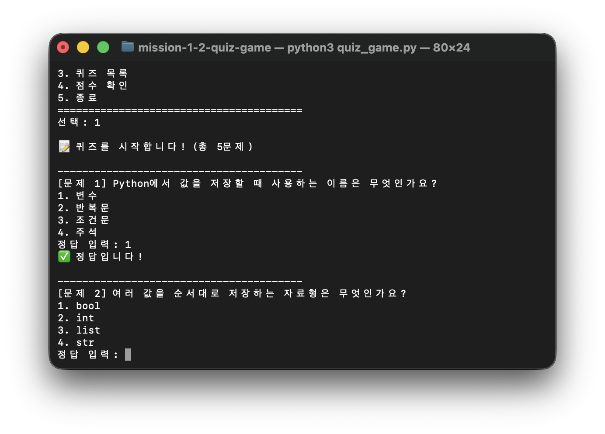
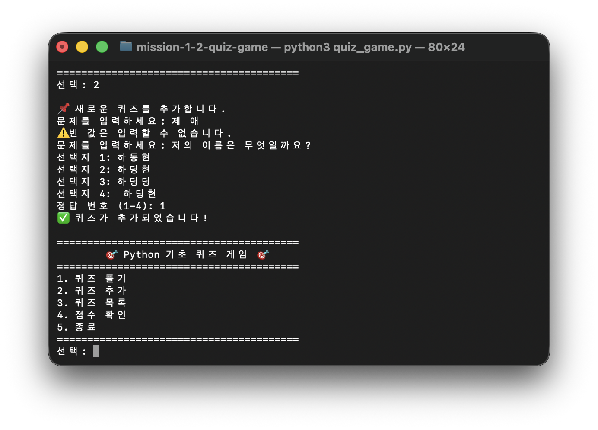
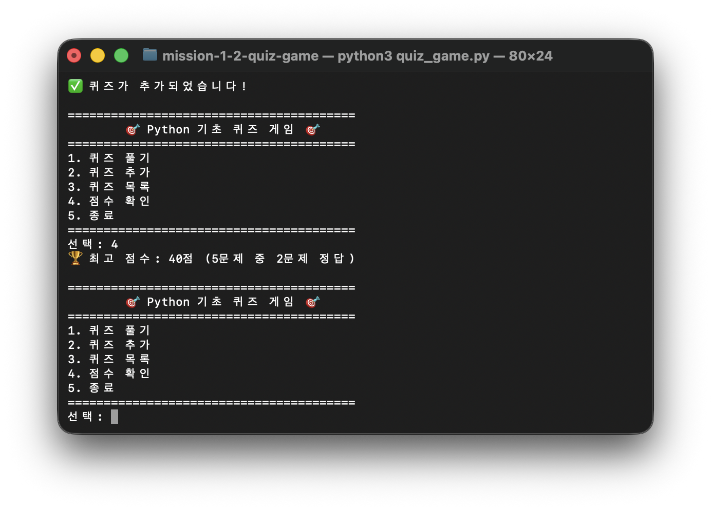

# Python 기초 퀴즈 게임

## 프로젝트 개요

터미널에서 실행하는 객관식 퀴즈 게임입니다. 퀴즈를 풀고, 새로운 문제를 추가하고, 목록과 최고 점수를 확인할 수 있습니다. 프로그램을 종료해도 `state.json`에 퀴즈와 최고 점수가 남습니다. `Quiz`, `QuizGame` 두 클래스로 역할을 나누고 입력 검증·예외 처리를 갖춰, Python 기초 문법·파일 입출력·Git 협업 흐름을 함께 연습하기 위한 미션 결과물입니다.

## 퀴즈 주제와 선정 이유

주제는 **Python 기초**입니다. 이 프로젝트에서 사용하는 변수, 자료형, 조건문, 반복문, 함수를 문제로 다시 확인할 수 있고, 입문자가 코드와 퀴즈 내용을 함께 설명하기 쉬워 이 주제를 선택했습니다.

## 실행 환경

- Python 3.10 이상
- 외부 라이브러리 없음

Python 버전을 확인하고 프로그램을 실행합니다.

```bash
python3 --version
python3 quiz_game.py
```

## 기능 목록

1. 저장된 모든 퀴즈 풀기
2. 문제, 선택지 4개, 정답 번호를 입력해 퀴즈 추가
3. 등록된 퀴즈 목록 확인
4. 최고 점수와 당시 정답 수 확인
5. 현재 데이터를 저장하고 종료

빈 입력, 숫자가 아닌 입력, 범위 밖 숫자는 안내 후 다시 입력받습니다. `Ctrl+C` 또는 입력 스트림 종료가 발생해도 가능한 데이터를 저장하고 종료합니다. `state.json`이 없으면 기본 퀴즈를 만들고, 파일이 손상되면 기본 데이터로 복구합니다.

## 파일 구조

```text
mission-1-2-quiz-game/
├── quiz_game.py          # Quiz, QuizGame 클래스와 실행 진입점
├── state.json            # 퀴즈 목록과 최고 점수
├── tests/
│   └── test_quiz_game.py # 표준 라이브러리 unittest 테스트
├── docs/
│   ├── evidence/         # 실행 및 Git 검증 기록
│   ├── screenshots/      # 실행 화면 캡처
│   └── superpowers/      # 설계와 구현 계획
├── .gitignore
└── README.md
```

## 실행 화면

| 메뉴 | 퀴즈 풀기 | 퀴즈 추가 | 점수 확인 |
|---|---|---|---|
|  |  |  |  |

## 데이터 파일

`state.json`은 프로젝트 루트에 있으며 UTF-8 JSON 형식을 사용합니다. JSON을 택한 이유는 Python의 `dict`/`list`와 구조가 거의 그대로 대응돼 변환 코드가 짧고, 사람이 텍스트 에디터로 직접 열어서 읽을 수 있을 만큼 가벼우면서 가독성이 좋기 때문입니다. 지금처럼 퀴즈 수가 적고 프로그램 하나만 이 파일을 쓰는 규모에는 데이터베이스보다 JSON 파일 하나가 더 단순합니다.

```json
{
  "quizzes": [
    {
      "question": "문제 내용",
      "choices": ["선택지 1", "선택지 2", "선택지 3", "선택지 4"],
      "answer": 1
    }
  ],
  "best_score": 80,
  "best_correct": 4,
  "best_total": 5
}
```

- `quizzes`: 퀴즈 객체 목록. 문제 수가 늘어날 수 있어 배열로 두었습니다.
- `choices`: 선택지 순서와 정답 번호가 그대로 이어지도록 배열로 저장합니다.
- `best_score`: 100점 기준 최고 점수
- `best_correct` / `best_total`: 최고 점수를 기록했을 때의 정답 수와 전체 문제 수. 점수만 저장하면 "80점"이 몇 문제 중 몇 문제인지 알 수 없어 두 값을 함께 둡니다.

아직 퀴즈를 풀지 않은 경우 점수 관련 값은 `null`입니다. 0점과 "아직 안 풀었음"을 구분하기 위한 값입니다.

## 테스트

외부 도구 없이 전체 테스트를 실행할 수 있습니다.

```bash
python3 -m unittest discover -s tests -v
python3 -m py_compile quiz_game.py
python3 -m json.tool state.json
```

## 설계와 구현 노트

### 클래스로 나눈 이유

`Quiz`는 문제 하나의 데이터(`question`, `choices`, `answer`)와 판정 동작(`display`, `is_correct`, `to_dict`, `from_dict`)을 담당합니다. `QuizGame`은 여러 퀴즈와 최고 점수를 관리하며 메뉴, 입력 검증, 게임 진행, 퀴즈 추가·목록, 파일 저장·불러오기를 담당합니다.

함수만으로도 구현할 수 있지만 그러면 퀴즈 목록과 최고 점수를 여러 함수에 계속 인자로 넘겨야 합니다. 클래스로 묶으면 객체가 자기 상태를 직접 들고 있어서 메서드 사이 데이터 전달이 단순해지고, 문제 하나의 규칙(`Quiz`)과 프로그램 전체 흐름(`QuizGame`)이라는 두 책임이 분명하게 나뉩니다.

### 메서드 구성

```text
입력 검증       read_number, read_non_empty
화면/게임 진행  show_menu, play_quizzes, add_quiz, list_quizzes, show_best_score
점수            update_best_score
데이터 저장     save_state, load_state, _set_defaults
전체 제어       run
```

각 메서드의 입력과 결과가 분명해서 한 기능을 고치거나 테스트할 때 다른 흐름을 모두 읽지 않아도 됩니다.

### `state.json` 저장·복원 흐름

```text
시작할 때
main → QuizGame 생성 → __init__ → load_state
     ├─ 파일 없음        → _set_defaults → save_state
     ├─ 정상 파일        → json.loads → Quiz.from_dict → 객체 목록 복원
     └─ 손상/읽기 실패    → 예외 처리  → _set_defaults → save_state

실행 중 / 종료할 때
퀴즈 추가 또는 최고 점수 갱신  → save_state
정상 종료 / Ctrl+C / EOF     → run()의 finally → save_state
```

`run()`은 `KeyboardInterrupt`와 `EOFError`를 잡아 안내를 출력하고, 정상 종료인지 예외 종료인지와 관계없이 `finally`에서 저장합니다. 이 처리가 없으면 입력이 갑자기 끊겼을 때 방금 추가한 퀴즈나 점수 변경이 저장되지 않을 수 있습니다.

### 예외 처리

파일이 손상돼 JSON 문법이 틀리면 `JSONDecodeError`, 키나 구조가 잘못되면 `KeyError`/`TypeError`/`ValueError`, 권한이나 디스크 문제로 읽고 쓰지 못하면 `OSError`가 날 수 있습니다. 예외를 잡지 않으면 프로그램이 그대로 죽기 때문에, 읽기 실패 시에는 기본 퀴즈로 복구하고 쓰기 실패 시에는 안내 후 `False`를 반환하도록 했습니다.

### 브랜치 전략과 커밋 규칙

기능을 독립적으로 만들고 검증한 뒤 `main`에 합치기 위해 브랜치를 나눠 작업했습니다. 실제 병합 기록은 아래 명령으로 확인할 수 있습니다.

```bash
git log --oneline --graph --all
```

커밋 접두어는 다음 기준으로 사용했습니다.

- `Feat`: 사용자 기능 추가
- `Fix`: 오류 수정
- `Data`: 기본 데이터 변경
- `Test`: 검증 코드나 실행 증거
- `Docs`: 문서
- `Chore`: 프로젝트 설정
- `Merge`: 브랜치 통합

### 확장성과 안정성

**데이터가 1,000개 이상으로 늘어난다면** 지금 구조의 한계가 드러납니다. `load_state`/`save_state`가 매번 파일 전체를 한 번에 읽고 쓰기 때문에, 문제 하나만 바뀌어도 전체 JSON을 다시 씁니다. 데이터가 커질수록 시작 시간·메모리 사용량·저장 시간이 함께 늘어나고, 특정 퀴즈를 찾는 것도 리스트를 처음부터 훑는 `O(n)` 검색이라 느려집니다. 이 규모를 넘어서면 필요한 행만 읽고 인덱스를 쓸 수 있는 SQLite 같은 가벼운 데이터베이스로 옮기는 편이 적합합니다.

**`state.json`이 손상되는 경우를 더 안전하게 만들려면** 백업 절차를 추가할 수 있습니다. 지금은 파싱에 실패하면 기본 데이터로 초기화만 하는데, 이러면 프로그램은 다시 실행되지만 손상되기 전 사용자의 데이터는 복구할 방법이 없습니다. 개선한다면 저장 직전에 기존 파일을 `state.json.bak`으로 복사해 두고, 새 데이터는 임시 파일에 먼저 쓴 뒤 성공했을 때만 원본 이름으로 교체하는 방식(원자적 쓰기)을 쓸 수 있습니다. 그러면 시작할 때 원본이 깨져 있어도 먼저 백업 복구를 시도하고, 백업까지 없을 때만 기본 데이터로 초기화하게 됩니다.

## Git 확인

공개 저장소: <https://github.com/ehdgus6697-debug/mission-1-2-quiz-game>

커밋 수와 브랜치 병합 기록은 다음 명령으로 확인합니다.

```bash
git rev-list --count main
git log --oneline --graph --all
```

실제 실행 결과(커밋 28개, 병합 커밋 3곳 포함 전체 로그)는 [`docs/evidence/git-log.md`](docs/evidence/git-log.md)에서 확인할 수 있습니다.

`clone`과 `pull` 실습의 실제 수행 기록은 [`docs/evidence/clone-pull.md`](docs/evidence/clone-pull.md)에서 확인할 수 있습니다.

## 클래스 요약

- `Quiz`: 문제, 선택지, 정답을 보관하고 문제 출력과 정답 판정을 담당합니다.
- `QuizGame`: 메뉴, 입력 검증, 게임 진행, 퀴즈 추가·목록, 점수, JSON 저장·불러오기를 관리합니다.

`__init__`은 객체가 만들어질 때 필요한 속성을 준비합니다. `self`는 지금 사용 중인 객체 자신을 가리킵니다. 기능을 메서드로 나누었기 때문에 각 부분을 따로 읽고 테스트할 수 있습니다.
